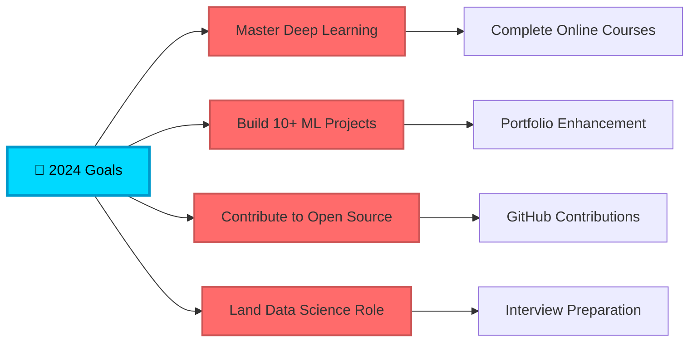

<div align="center">

# 🎯 HERIT KUMAR


[](https://herit007.github.io)
[](https://linkedin.com/in/herit007)
[](mailto:your.email@example.com)


</div>

---

## 💫 About Me

```python
class DataScientist:
    def __init__(self):
        self.name = "Herit Kumar"
        self.role = "Aspiring Data Scientist"
        self.location = "India 🇮🇳"
        self.education = "Building Skills Through Projects"
        self.languages = ["Python", "SQL", "JavaScript"]
        self.current_focus = ["Machine Learning", "Data Visualization", "Statistical Analysis"]
        
    def say_hi(self):
        print("Thanks for dropping by! Let's connect and build something amazing together!")

me = DataScientist()
me.say_hi()
```

🔭 **Currently Working On:** Building an impressive data science portfolio  
🌱 **Currently Learning:** Advanced ML algorithms, Deep Learning, and MLOps  
💡 **Fun Fact:** I believe every dataset tells a story - my job is to translate it  
⚡ **Philosophy:** *"Data is the new oil, but insights are the refined fuel"*

---

## 🛠️ Tech Arsenal

<div align="center">

### 📊 Data Science & ML


### 📈 Data Visualization & BI


### 💾 Databases & Tools


### 🌐 Web Development


</div>

---

## 🚀 Featured Projects

<div align="center">

<table>
<tr>
<td width="50%">

### 🤖 AI Project Planner
Full-stack AI-powered project management tool
- **Tech:** React, Node.js, Express, Gemini API
- **Features:** Smart task generation, progress tracking
- **Deployment:** Vercel + Render

[](https://github.com/herit007)

</td>
<td width="50%">

### 🍽️ Spice Haven Restaurant
Premium restaurant website with elegant design
- **Tech:** HTML, CSS, JavaScript
- **Features:** Dark theme, menu showcase, reservations
- **Design:** Luxury & modern aesthetics

[](https://github.com/herit007)

</td>
</tr>

<tr>
<td width="50%">

### 📊 Data Analytics Portfolio
Streamlit-based portfolio showcasing projects
- **Tech:** Streamlit, Python, Pandas
- **Features:** Project gallery, interactive dashboards
- **Theme:** Dark SaaS aesthetic

[](https://github.com/herit007)

</td>
<td width="50%">

### 🛠️ Shiv Auto Management
Bike repair shop management system
- **Tech:** Streamlit, SQLite
- **Features:** Customer tracking, billing, inventory
- **Deployment:** Streamlit Cloud

[](https://github.com/herit007)

</td>
</tr>

<tr>
<td width="50%">

### 🎮 Memory Card Game
Cross-platform card flipping game
- **Tech:** HTML, CSS, JavaScript
- **Features:** Difficulty levels, coin system, skins
- **Monetization:** AdMob simulation

[](https://github.com/herit007)

</td>
<td width="50%">

### 📈 AI Data Dashboard
Power BI inspired analytics tool
- **Tech:** JavaScript, PapaParse, Chart.js
- **Features:** CSV upload, interactive charts
- **Design:** Modern BI aesthetics

[](https://github.com/herit007)

</td>
</tr>
</table>

</div>

---

## 📊 GitHub Analytics

<div align="center">
  


</div>

<div align="center">
  


</div>

<div align="center">


</div>

---

## 🏆 GitHub Trophies

<div align="center">
  


</div>

---

## 📈 Contribution Snake

<div align="center">

<picture>
  <source media="(prefers-color-scheme: dark)" srcset="https://raw.githubusercontent.com/herit007/herit007/output/github-contribution-grid-snake-dark.svg">
  <source media="(prefers-color-scheme: light)" srcset="https://raw.githubusercontent.com/herit007/herit007/output/github-contribution-grid-snake.svg">
  
</picture>

</div>

---

## 💼 Professional Skills Matrix

<div align="center">

| Skill Category | Technologies | Proficiency |
|:---:|:---:|:---:|
| **Data Analysis** | Python, Pandas, NumPy | ⭐⭐⭐⭐⭐ |
| **Machine Learning** | Scikit-learn, TensorFlow | ⭐⭐⭐⭐ |
| **Data Visualization** | Matplotlib, Seaborn, Plotly | ⭐⭐⭐⭐⭐ |
| **Business Intelligence** | Power BI, Streamlit | ⭐⭐⭐⭐ |
| **Database Management** | SQL, MySQL, SQLite | ⭐⭐⭐⭐ |
| **Statistical Analysis** | Hypothesis Testing, Probability | ⭐⭐⭐⭐ |
| **Web Development** | HTML, CSS, JavaScript, React | ⭐⭐⭐⭐ |

</div>

---

## 📚 Latest Blog Posts

<!-- BLOG-POST-LIST:START -->
- 🔥 Building a Full-Stack AI Project Planner with React and Gemini API
- 📊 Data Visualization Best Practices: From Raw Data to Insights
- 🤖 Getting Started with Machine Learning: A Practical Guide
- 💡 Why Every Data Scientist Should Learn Web Development
- 🚀 Deploying Streamlit Apps: A Complete Guide
<!-- BLOG-POST-LIST:END -->

---

## 🎯 Current Focus & Goals



---

## 🤝 Let's Connect & Collaborate!

<div align="center">

I'm always excited to collaborate on interesting data science projects, contribute to open source, or just chat about ML and tech!

### 📬 Reach Out To Me

[](https://linkedin.com/in/herit007)
[](mailto:your.email@example.com)
[](https://twitter.com/herit007)
[](https://herit007.github.io)

### ☕ Support My Work

If you find my projects helpful, consider buying me a coffee!

[](https://www.buymeacoffee.com/herit007)

</div>

---

<div align="center">

### 💭 Quote of the Day


### 👀 Profile Views


---


### ⭐️ From [herit007](https://github.com/herit007) with ❤️

**"The best way to predict the future is to create it through data."**

</div>
